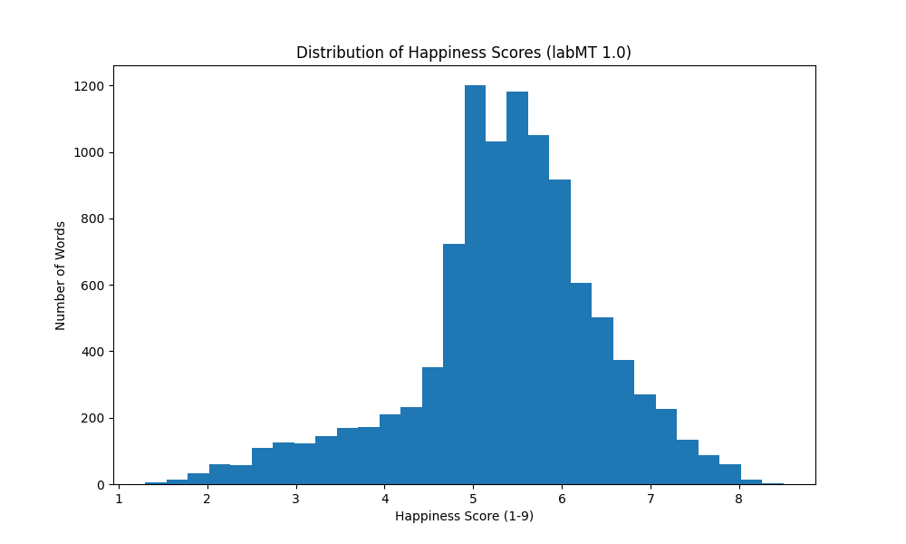
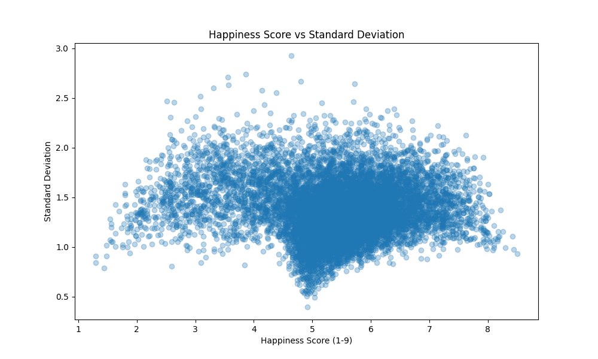

# New York Times Headlines under a Hedonometer: Measuring Happiness in News Repoerting from 2015 to 2025

# Project Aim

In the years following the pandemic, a widespread perception seems to emerge that the world has become sadder and more unstable. Our aim was to contribute to a larger body of literature about the emotions news exhibit. Existing research over large data sets points to headlines becoming more negative over time (Hughes and Halberstadt 2022). We wanted to test this with one single major news outlet. We chose The New York Times as it is read globally and covers international affairs extensively.

# Research Question 
How has the mood of New York Times (NYT) news changed in the period between 2015 and 2025 and has the pandemic made a difference?

# How to run
1) Create + activate .venv
2) Install packages: python -m pip install -r requirements.txt
3) Run: Open src/ folder. Scripts have been enumerated in their title. Run them in order. Additional bits of code are in the comments.

# Repository Map

```bash
hedonometer-project/
│
├── data/
│   ├── raw/
│   └── processed/
│
├── figures/
│   ├── hedonometer_visuals/
│   ├── top_words_years_visuals/
│   ├── nyt_happiness_vs_frequency_visuals/
│   ├── nyt_bootstraps/
│   ├── composite_words/
│   ├── nyt_timelines/
│   └── nyt_overlaps/
│
├── src/
│
├── .DS_Store
├── .gitignore
├── README.md
└── requirements.txt
```


# ​​Data

- `NYT Article Search API`

 We collected approximately 1000 NYT World section headlines per year from 2019 to 2025 using the Article Search API. Requests filtered by section.name:("World") with 'sort=relevance' and an empty query string. Results are cached as JSON files and treated as read-only. Each JSON file contains full article metadata, including headline, abstract, keywords, publication date, byline, and word count. Our analysis uses only the 'headline.main' field.

- `labMT Hedonometer`

The labMT lexicon contains approximately 10,000 words rated for happiness on a 1-9 scale by Mechanical Turk workers in 2011. A score of 1 is very negative, 5 is neutral, and 9 is very positive. It was constructed from four corpora: Twitter, Google Books, NYT, and song lyrics. 

 ### Data Dictionary
| VARIABLE | DESCRIPTION | TYPE | MISSING VALUES |
|----------|-------------|------|----------------|
| **word** | the English word being rated | text | No missing values |
| **rank** | overall frequency rank across all corpora | integer | No missing values |
| **happs** | average happiness score (scale 1–9) | float | No missing values |
| **stddev** | standard deviation of happiness ratings (how much raters disagreed) | float | No missing values |
| **rank.1** | frequency rank in Twitter | float | 5192 missing values (word not in top 5000) |
| **rank.2** | frequency rank in Google Books | float | 5192 missing values |
| **rank.3** | frequency rank in New York Times | float | 5192 missing values |
| **rank.4** | frequency rank in Music Lyrics | float | 5192 missing values |

- A missing rank means the word did not appear in the top 5000 most frequent 
  words in that corpus.
The NYT data was scored using the labMT dataset.

### Histogram of happiness score 


The histogram shows that most words in the labMT dataset score around 5 on the 
happiness scale, with a mean of 5.37 and a median of 5.44. The distribution is 
roughly bell-shaped but slightly skewed to the left, meaning there are more words 
trailing off toward the sad end than the happy end. The middle 90% of words fall 
between scores of 3.18 and 7.08, suggesting that truly extreme words are relatively rare.


### We have selected a time period from 2015 to 2025, separating it into two periods: before and after the pandemic.

The justification for this choice is that the covid pandemic has significantly impacted many processes in the world. The public discourse commonly regards the years following the pandemic as “worse” than the ones prior to it. With our research question, we aimed at getting empirical evidence on whether the discourse  actually got sadder/ more charged.
​

#### Why did we choose to scrape data this way?

We have conditioned the script to scrape data under the “world” section, meaning that it will pull global news.

In order to get a neutral dataset, we have scraped headlines containing typical report words “claim”, “discuss”, “report “, and “state”. Forms/variants of the words also counted as long as the root was the same. 

The first 3 showed up as verbs; “state” occasionally showed up as a noun(as in “Islamic state”). Generally getting headlines with these words allowed us to access the discourse in the news articles. 

We have tested including “say” and its derivatives, following the same logic as the other report words. This filter, however, gave flawed results as “say” is so prevalent in the headlines and body text, respectively, api pulls articles for only the last months of the year, as it filters by “best fit” and “relevance,” and those conditions get fulfilled with the most recent data, that being the end of the year.

# Methods
To test this research question empirically, we scored NYT World section headlines for emotional tone using the labMT hedonometer lexicon, a dataset from 2011 that ranks words on a happiness scale from 1 to 9. In the first part of our research, we scored exactly 1000 headlines per year between 2019 and 2025. When the mean happiness scores did not show the expected downward trend, we broadened our scope and became more selective about which words we included in the scoring. This led us to examine two periods: 2015 to 2019, covering the years leading up to the pandemic, and 2020 to 2025, covering the pandemic and its aftermath. 
This README documents the project in two parts: first, how we conducted the initial analysis scoring headlines from 2019 to 2025, and second, how we expanded the research to compare the pre- and post-pandemic periods. 

1. Data Collection

We collected exactly 1000 NYT World section headlines per year from 2019 to 2025 using the Article Search API. Requests filtered by section.name:("World") with sort=relevance and an empty query string. Results are cached in data/cache/ as JSON files and treated as read-only.
Each JSON file contains full article metadata including headline, abstract, keywords, publication date, byline, and word count. Our analysis uses only the headline.main field.

2. Tokenization

Each headline is lowercased and split by whitespace using Python's .split(). This is intentionally simple. It does not handle punctuation, so "war," and "war" are treated as different tokens. The word "war," with a comma attached would not match the labMT entry "war" and would be silently skipped.

3.  Headline Scoring
   
Each headline receives a single happiness score: the mean labMT rating of all matched words. Words not in the lexicon are silently skipped. A headline where no words match at all returns no score and is excluded from further analysis. 
We did not apply a stopword filter before scoring. Common words like "the", "a", "in", and "of" pass through tokenisation. However, most stopwords do not appear in the labMT lexicon, so they are automatically ignored during scoring. Only words with a labMT entry contribute a score.

Example:

Headline: "War kills thousands in Syria"

"war" = 2.10

"kills" = 2.00

"thousands" = 5.30

"syria" = not in labMT, skipped

Score = (2.10 + 2.00 + 5.30) / 3 = 3.13

Coverage across all years was between 99% and 100%, meaning almost every headline had at least one matched word. This step produces an array of approximately 1000 happiness scores per year.


For the 2015-2025 data set, we scored NYT World section headlines for emotional tone using the labMT hedonometer lexicon, a dataset from 2011 that ranks words on a happiness scale from 1 to 9. In the first part of our research, we scored exactly 1000 headlines per year between 2019 and 2025. When the mean happiness scores did not show the expected downward trend, we broadened our scope and became more selective about which words we included in the scoring. This led us to examine two periods: 2015 to 2019, covering the years leading up to the pandemic, and 2020 to 2025, covering the pandemic and its aftermath. 
This README documents the project in two parts: first, how we conducted the initial analysis scoring headlines from 2019 to 2025, and second, how we expanded the research to compare the pre- and post-pandemic periods. 


## Sanity checks 

There were several checks performed in the code to verify whether the dataset is loaded correctly and structured well.

For this project, .csv files were used; the small size of the yearly corpora meant it was possible to analyze the data manually which we used to our advantage. The files clearly show key columns like date, headline, section name, and document type, which made the analysis more straightforward.

Verified that all the happiness scores fell within the range of 1 to 9. The LabMT lexicon rates words on this scale, so any score outside this scale would be an error in the scoring function.

Checked that the dictionary of happiness scores was created correctly by seeing if it contained approximately 10,000 words. Also checked those words, for example “love”, to have a high score on the scale and “war” to have a lower score. If these did not match, it would indicate that the lexicon was not loaded properly.

For the stop words, scikit-learn has a built-in ENGLISH_STOP_WORDS library, which provides a standardized set of approximately 318 common English words. This is more comprehensive than a manual list and is the academic standard for text analysis. 


## Bootstrap
NYT publishes between 70,000 and 90,000 articles per year. Our sample includes only 1000 World section headlines per year. This raises the question of how reliable our mean happiness score is. We apply a non-parametric bootstrap to estimate this uncertainty. Rather than collecting new samples, the bootstrap resamples our existing data with replacement to simulate what different samples might have looked like. Non-parametric means we make no assumptions about the distribution of scores and we let the data speak for itself.
The bootstrap works as follows:
Resample the array of ~1000 scores with replacement. This produces a new sample of the same size
Compute the mean of that resample
Repeat 2000 times
Take the 2.5th and 97.5th percentiles of the 2000 means as the 95% confidence interval. We use numpy.random.default_rng(42) for reproducibility. Anyone rerunning the code should get identical results.
Resampling with replacement means some headlines are picked multiple times and some not at all. This variation across 2000 resamples simulates what would happen if we had collected slightly different sets of headlines, giving us an estimate of sampling uncertainty

## Privacy concerns
In order to not commit API keys, which are considered sensitive info, we have used an .env file( a text configuration file used to define environment-specific variables). 
1. create a file, store the api keys within a variable
2. pip install python-dotenv – install a module that allows python to read environment variables from .env

Later on we have used just the variable name inside the scripts, so the actual api keys were pulled from the .env file. The file contents were not committed and stayed local on the computers. 


# Figures + findings

Across all years, we consistently used neutral terms such as “state,” “report,” “claims,” and “says” to avoid introducing bias into the analysis. As expected, these words appeared with the highest frequency each year, reflecting their neutral and widely used nature. However, beyond these common terms, each year also revealed additional high frequency words, indicating the presence of distinct themes or emphases specific to that period.

### Scatterplot of happiness vs standard deviation 


The scatterplot shows that the most contested words tend to cluster around the middle happiness scores rather than at the extremes. 
Words like "whiskey" and "cigarettes" are contested because people associate them with both 
pleasure and addiction. "Churches" and "capitalism" are politically and culturally divisive, 
meaning people's backgrounds strongly influence how they rate them. "Mortality" sits in the 
middle because it can feel clinical and neutral to some, but deeply distressing to others.

### Findings
- `2017`


In 2017, some of the most frequent words were Islamic, China, and Trump. This makes sense because 2017 was the first year of Donald Trump’s presidency, when there was a lot of news coverage about his policies and international relations.

Islamic appears about 14 times and has a happiness score of around 4.8, which is slightly negative to neutral. China and Trump both appear about 12 times and have scores close to 5, which is neutral. This shows that Islamic is viewed a bit more negatively compared to the other two words.

These words are likely common because of major political and global issues during that time, especially related to Trump’s first year in office. However, the happiness scores come from a dataset created in 2011, so they may not fully reflect how these words were perceived in 2017.

- `2021`


2021 was a year that resolved mainly about health related topics, which resulted in frequent use of words like emergency, virus, mask or death. 

This is the result of the still active and growing in danger epidemic of COVID-19 that has taken over the world. There were very few words that related to other events but we can highlight “Haiti” that relates to earthquakes in this part of the world and "France", “workers” and “abuse” that relate to the 2021 French labour protests. 

This creates an overall impression on what the news were focused on, when the whole world was locked down and faced a major crisis. The word happiness vs frequency chart informs us that most words were scored on the neutral part of the scale, but they were less frequent than those with lower ratings. It shows how the news were negative and more focused on bad events. 


- `2023`


Words indicative of discourse are related to geopolitics: state, China, war, Russia, officials, military.  Given the events of the year, “Russia” scores high in frequency hence the ongoing war with Ukraine since 2022. Words relating to the Israel-Gaza war also score high on frequency, however Gaza appears only once, whereas Israel appears multiple times.
Common words that are shared between news reports relating to military conflicts are: killed, children, military, attack, nuclear. 

Overall the news for 2023 were majorly war related.  Neutral/not obviously charged words like state, officials, military are structurally tied to conflict in this case. 

- `2025`


In 2025, some of the most frequent words include Trump, Palestinian, Israel, and Russia. This makes sense because of major political events and ongoing conflicts that were widely covered in the news.

These words have happiness scores that are slightly negative to neutral. Trump appears the most, likely because of his reelection. Palestinian and Israel are also common due to the conflict in that region, while Russia appears often because of its role in global affairs.

However, the happiness scores come from a dataset created in 2011, so they may not fully reflect how people felt about these words in 2025.

| word | happs_score | stddev|
|------|-------------|-------|
| jeffrey | 5.46 | 1.0539 |
| charlie | 5.24 | 1.276 |
| kirk | 5.84 | 1.4507 |
| cuomo | 5.16 | 0.7918 |
| penn | 5.42 | 1.295 |
| hillary | 5.12 | 1.4234 |
| clinton | 5.68 | 1.5836 |
| blair | 5.04 | 1.2115 |
| tony | 5.52 | 1.1822 |
| trump |5.03 | 1.7053 |
| wagner | 5.44 | 0.9723 |
| ice | 5.8 | 1.4846 |
| southern | 5.64 | 1.6258 |
| northern | 5.22 | 1.3293 |
| eastern | 5.76 | 1.4223 |
| western | 6.1 | 1.359 |
| southeast | 5.68 | 1.2196 |
| mideast | 4.82 | 1.5609 |
| european | 5.94 | 1.1678 |
| american | 6.74 | 1.5228 |
| russians | 5.2 | 1.3851 |
| soviet | 4.6| 1.33655 |
| israelis | 5.14 | 1.3554 |
| palestinians | 4.5 | 1.1995 |
| arab | 4.5 | 1.594 |
| vietnam | 4.42 | 1.9804 |
| democratic | 6.32 | 1.6591 |
| republican | 4.42 | 1.9176 |
| communist | 4.32 | 1.7431 |
| conservative | 4.54 | 1.9505 |
| liberal | 5.8 | 2.1665 |
| democrats | 5.5 | 1.9923 |
| politicians | 3.34 | 1.1359 |
| reign | 5.06 | 1.5308 |
| voting | 6.02 | 1.3775 |
| re-election | 4.76 | 1.6971 |
| sovereignty | 5.88 | 1.7516 |
| demonstration | 5.88 | 1.2185 |
| rebellion | 4.29 | 1.6833 |
| revolution | 5.34 | 1.394 |
| revolutionary | 6.24 | 1.8578 |
| protestors | 3.8 | 1.6903 |
| oppose | 3.82 | 1.4384 |
| authority | 4.74 | 1.5884 |
| surrender | 4.08 | 1.6762 |
| borders | 4.96 | 1.5248 |
| immigration | 5.2 | 1.3553 |
| monitoring | 5.06 | 1.2521 |
| cameras | 6.62 | 1.2919 |
| undercover | 5.04 | 1.6031 | 
| deadline | 3.66 | 1.1537 |
| strife | 4.02 | 1.8349 |
| abyss | 4.1 | 1.7108 |


# Limitations of the hedonometer 
1. Static Word Meanings - The instrument does not account for words with multiple meanings (polysemi). While the researchers argue that such error is overridden by the massive dataset, it remains a limitation for fine-grained analysis. 

2. Counting different forms of the same word - The study avoided "stemming" meaning words, so it treated several word forms as unique entries with their own scores. This makes it easier to see distinct emotional nuances provided by tense and context. For example, the researchers found that "captured" (3.22) has a significantly different score than "capture". However, this makes it harder to aggregate the total frequency of an underlying concept as the data for a single idea is split across many different word forms. 

3. Omitting rare or specialized words displaying emotion - Instead of selecting words based on their emotional meaning, the researchers merged the top 5000 most frequent words from four disparate sources: Twitter, Google Books, music lyrics, and the New York Times. This makes it easier to achieve high "coverage" of a text, ensuring the instrument has data for a large percentage of the words actually being used in common language. However, it makes it harder to see the emotional impact of rare or specialized words that may carry heavy sentiment but do not appear frequently enough to make the top 5,000 list

4. Absence of Context and Structure - Text is treated as a simple collection of words, calculating happiness based on individual word frequencies while ignoring sentence structure or word order. This makes the instrument transparent, fast, and highly robust when dealing with "web-scale" data like billions of tweets, where structural complexity might be computationally prohibitiveConversely, it cannot account for word order or negated sentiments (e.g., "not happy"), which effectively omits a significant portion of a text's actual content. It makes it hard to also recognize meaning in small texts (like single sentences) where irony, sarcasm, or negation (e.g., "not happy") would completely change the sentiment but are missed by a word-by-word average

5. Contamination from accounts with disputed authenticity - The dataset treats all accounts equally, meaning the emotional signal is a blend of accounts belonging to individuals, news organisations, companies and automated bots. This makes it difficult to distinguish genuine human sentiment from corporate broadcasting. The dataset is also vulnerable to entities that intentionally alter expressions online to misinform and manipulate. 

# General project limitations
1. Headline only scoring: We scored headlines only. Headlines are written to attract attention and may not reflect the emotional content of the full article. Scoring abstracts or full article text would give a more complete picture.
2. No stopword filter: We did not remove stopwords before scoring. In practice this has limited impact because most stopwords are absent from labMT. However, any stopwords that do appear in the lexicon contribute to scores without adding meaningful sentiment information.
3. Coverage does not equal accuracy: Coverage of 99-100% means most headlines had at least one matched word. But a headline scored on one or two words is less reliable than one scored on five or six. We do not report the average number of words matched per headline.
4. labMT cultural assumptions: The lexicon was built from ratings by English-speaking Mechanical Turk workers. Their happiness ratings carry cultural and linguistic assumptions that may not generalise across topics, time periods, or regions. The word "death" scores low regardless of whether it appears in a tragedy or a historical analysis. Context is entirely ignored.
5. sort=relevance with empty query: Our API requests used relevance sorting with no search query. This is not a random sample. The API's definition of relevance without a query is unclear, and results may reflect indexing priorities rather than a representative cross-section of World section articles.
6. 2023 sample size: The 2023 dataset contains only 449 headlines. The estimate for this year is less precise and should be interpreted with more caution than other years.
7. “Say” as a filter word. We have tested including “say” and its derivatives, following the same logic as the other report words. This filter, however gave flawed result as “say” is so prevalent in the headlines and body text respectively, api pulls articles for only the last months of the year, as it filters by “best fit” and “relevance” and those conditions get fulfilled with the most recent data, that being the end of the year.


# Conclusion 
No statistically significant changes were observed in mood between 2015 and 2025. Most words scored as neutral, even during years with major geopolitical events. This may be due to the relatively small corpus for the 2015-2025 data set, which ranged from 40 to 300 articles per year, making the sample less representative. Additionally, the LabMT hedonometer is based on 2011 data, so it may not fully capture shifts in sentiment or accurately reflect the mood of headlines over time. Similarly, the data from 2019 to 2025 also showed no significant changes in mood. Once again, most words scored as neutral, even though notable events occurred during these years.


# Possible improvements

The dataset can be updated to include modern slang, hashtags, and cultural references that have evolved since its creation. 

Instead of single words, the instrument could include common short phrases. This would make handling negation possible ("not happy") and could include indicative short phrases ("child abuse", "sex scandal") to provide more accurate sentiment readings. 

Another significant improvement would be distinguishing between human users and automated bots or news organizations, which currently mix individual emotional signals with corporate or automated messaging.

Currently, we used the Article Search API to collect data by querying specific keywords and then organizing the results into dataframes. An alternative approach would be to use the NYT Archive API, which allows us to retrieve all articles within a given time frame. We could then filter the data within the dataframes afterward, effectively reversing the order of operations. This method may provide a more comprehensive dataset and reduce potential bias from pre-selecting keywords.

# AI use
For this project the following AI models were used for vibe coding and debugging:
- Deepseek
- Uva AI chat
- Chat GPT
- NotebookLM
- Claude


