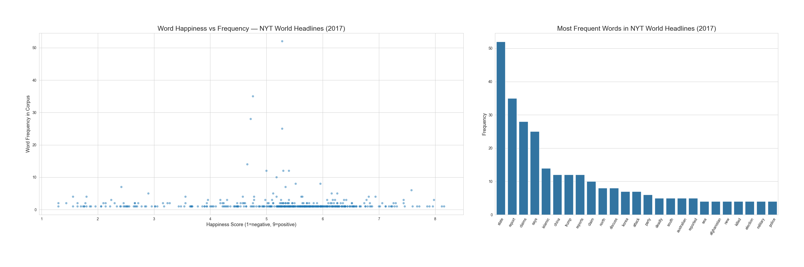
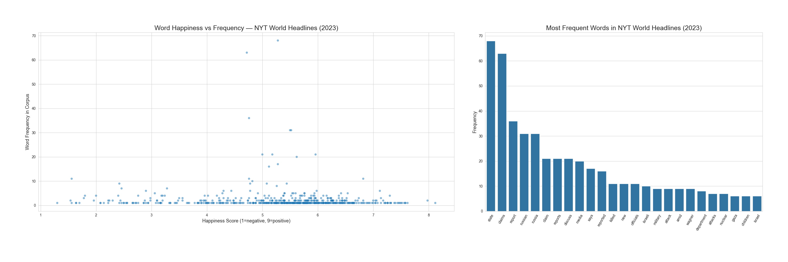
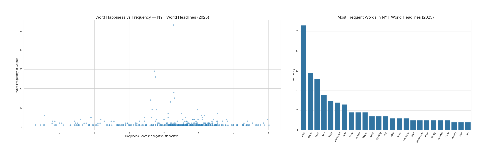

# New York Times Headlines under a Hedonometer: Measuring Happiness in News Repoerting from 2015 to 2025

# Introduction

# Data Dictionary
| VARIABLE | DESCRIPTION | TYPE | MISSING VALUES |
|----------|-------------|------|----------------|
| **word** | the English word being rated | text | No missing values |
| **rank** | overall frequency rank across all corpora | integer | No missing values |
| **happs** | average happiness score (scale 1–9) | float | No missing values |
| **stddev** | standard deviation of happiness ratings (how much raters disagreed) | float | No missing values |
| **rank.1** | frequency rank in Twitter | float | 5192 missing values (word not in top 5000) |
| **rank.2** | frequency rank in Google Books | float | 5192 missing values |
| **rank.3** | frequency rank in New York Times | float | 5192 missing values |
| **rank.4** | frequency rank in Music Lyrics | float | 5192 missing values |

A missing rank means the word did not appear in the top 5000 most frequent 
words in that corpus.

# Histogram of happiness score (figures/histogram_happs.png) - `this would be with data dictionary`
The histogram shows that most words in the labMT dataset score around 5 on the 
happiness scale, with a mean of 5.37 and a median of 5.44. The distribution is 
roughly bell-shaped but slightly skewed to the left, meaning there are more words 
trailing off toward the sad end than the happy end. The middle 90% of words fall 
between scores of 3.18 and 7.08, suggesting that truly extreme words are relatively rare.

# Scatterplot of happiness vs standard deviation (figures/scatter_happs_stddev.png) - `lets keep it relevant to the figures`
The scatterplot shows that the most contested words tend to cluster around the middle happiness scores rather than at the extremes. 
Words like "whiskey" and "cigarettes" are contested because people associate them with both 
pleasure and addiction. "Churches" and "capitalism" are politically and culturally divisive, 
meaning people's backgrounds strongly influence how they rate them. "Mortality" sits in the 
middle because it can feel clinical and neutral to some, but deeply distressing to others.

### Research question: `after introduction`
Have news reports gotten sadder or more emotionally charged from 2015 till 2025 and what might be reasons for it / what can that indicate about current world affairs? 

# ​​Data: `with data dictionary`

- `NYT Article Search API`

 We collected approximately 1000 NYT World section headlines per year from 2019 to 2025 using the Article Search API. Requests filtered by section.name:("World") with 'sort=relevance' and an empty query string. Results are cached in 'data/cache/' as JSON files and treated as read-only. Each JSON file contains full article metadata, including headline, abstract, keywords, publication date, byline, and word count. Our analysis uses only the 'headline.main' field.

- `labMT Hedonometer`

 The labMT lexicon contains approximately 10,000 words rated for happiness on a 1-9 scale by Mechanical Turk workers. A score of 1 is very negative, 5 is neutral, and 9 is very positive. It was constructed from four corpora: Twitter, Google Books, NYT, and song lyrics. 

The NYT data was scored using the labMT dataset.

We have selected a time period from 2015 to 2025, separating it into two periods: before and after the pandemic.

 The justification for this choice is that the covid pandemic has significantly impacted many processes in the world. The public discourse commonly regards the years following the pandemic as “worse” than the ones prior to it. With our research question, we aimed at getting empirical evidence on whether the discourse  actually got sadder/ more charged.
​

#### Why did we choose to scrape data this way?

We have conditioned the script to scrape data under the “world” section, meaning that it will pull global news.

In order to get a neutral dataset, we have scraped headlines containing typical report words “claim”, “discuss”, “report “, and “state”. Forms/variants of the words also counted as long as the root was the same. 

The first 3 showed up as verbs; “state” occasionally showed up as a noun(as in “Islamic state”). Generally getting headlines with these words allowed us to access the discourse in the news articles. 

We have tested including “say” and its derivatives, following the same logic as the other report words. This filter, however, gave flawed results as “say” is so prevalent in the headlines and body text, respectively, api pulls articles for only the last months of the year, as it filters by “best fit” and “relevance,” and those conditions get fulfilled with the most recent data, that being the end of the year.

# Methods:

# Figures + findings:

- `2017`

- `2021`

2021 was a year that resolved mainly about health related topics, which resulted in frequent use of words like emergency, virus, mask or death. 

This is the result of the still active and growing in danger epidemic of COVID-19 that has taken over the world. There were very few words that related to other events but we can highlight “Haiti” that relates to earthquakes in this part of the world and "France", “workers” and “abuse” that relate to the 2021 French labour protests. 

This creates an overall impression on what the news were focused on, when the whole world was locked down and faced a major crisis. The word happiness vs frequency chart informs us that most words were scored on the neutral part of the scale, but they were less frequent than those with lower ratings. It shows how the news were negative and more focused on bad events. 

- `2023`

Words indicative of discourse are related to geopolitics: state, China, war, Russia, officials, military.  Given the events of the year, “Russia” scores high in frequency hence the ongoing war with Ukraine since 2022. Words relating to the Israel-Gaza war also score high on frequency, however Gaza appears only once, whereas Israel appears multiple times. Common words that are shared between news reports relating to military conflicts are: killed, children, military, attack, nuclear. 
Overall the news for 2023 were majorly war related.  Neutral/not obviously charged words like state, officials, military are structurally tied to conflict in this case. 

- `2025`
  

# Limitations:

# Conclusion: 
